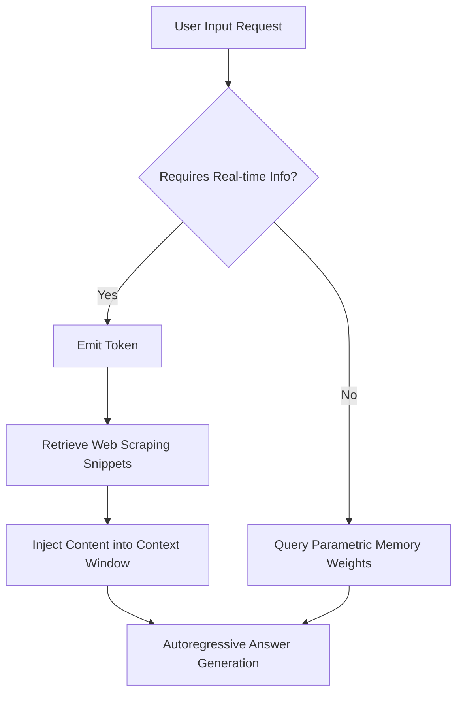

## 1. Executive Summary

In "How I use LLMs," AI researcher Andrej Karpathy delivers a masterclass on the practical, real-world deployment of Large Language Models (LLMs) across daily productivity, software engineering, research, and creative workflows. Framing an LLM as a lossily compressed "zip file" of internet knowledge fine-tuned for assistant alignment, Karpathy systematically breaks down the core mechanics of LLM interaction: tokenization, context windows, reasoning models, tool integration, and multimodal capabilities. 

He surveys today's ecosystem—anchored by OpenAI's ChatGPT alongside competitors like Anthropic's Claude, Google's Gemini, Meta AI, Microsoft Copilot, and xAI's Grok—and outlines how modern power users move beyond static chat. By leveraging web search tools, Python code execution environments, document context injection, IDE integrations like Cursor, and end-to-end speech and vision models, users transform static text prediction engines into dynamic, autonomous agents capable of complex analysis and creation.

---

## 2. Key Takeaways

1. **LLMs as Compressed Knowledge**: An LLM functions like a lossy, pre-trained "zip file" of internet text fine-tuned to adopt a helpful assistant persona via reinforcement learning from human feedback (RLHF).
2. **Context Window is Working Memory**: Prompting is fundamentally about managing the context window—the finite set of tokens representing the conversational state that the model evaluates simultaneously.
3. **Specialized Ecosystem Positioning**: While ChatGPT remains the feature-rich incumbent, models like Claude excel at UI rendering (Artifacts), Gemini offers massive context windows, and Cursor leverages LLMs inside codebases ("vibe coding").
4. **Tool Augmentation Extends Capability**: Models overcome strict cutoff dates and mathematical limits by generating special tokens that trigger external software tools, such as web search engines and sandboxed Python code execution environments.
5. **Thinking Models Trade Time for Quality**: Advanced reasoning models spend compute time generating internal monologues or extended chains-of-thought prior to producing a final response, significantly improving performance on complex logic and math tasks.
6. **Native Multimodality**: Next-generation workflows process direct audio-to-audio and video-to-video streams within unified neural weights rather than passing inputs through disjointed cascade pipelines (STT -> Text LLM -> TTS).
7. **Personalization via System State**: Long-term memory, custom instructions, and Custom GPTs provide steady-state contextual framing across sessions, reducing repetitive prompting overhead.

---

## 3. Topics Covered

1. **The LLM Ecosystem**: An overview of leading commercial and open-weight models, evaluation benchmarks, and competitive positioning across major AI labs.
2. **LLM Mechanics and Tokenization**: An explanation of how text is encoded into discrete integer tokens and processed within a bounded context window working memory.
3. **Knowledge Retrieval**: Practical demonstrations of leveraging parametric memory for rapid general reference while verifying low-frequency or critical details.
4. **Context Window Management**: Techniques for managing conversation history, avoiding context pollution, and staying within working memory limits.
5. **Model Versions and Pricing Tiers**: A guide to selecting appropriate model sizing, cost structures, and tier-based feature availability.
6. **Thinking and Reasoning Models**: An analysis of models that generate internal reasoning steps prior to final output generation.
7. **Web Search Tool Augmentation**: Mechanics of how models issue special search tokens to retrieve up-to-date external internet knowledge.
8. **Deep Research Workflows**: Utilizing agentic search loops to synthesize comprehensive research reports across diverse sources.
9. **Context Injection via File Uploads**: Uploading documents (PDFs, code files) directly into context for structured extraction, summarization, and interactive Q&A.
10. **Python Interpreter Integration**: Executing sandboxed Python code to handle precise calculations, data manipulations, and program logic.
11. **Advanced Data Analysis**: Leveraging inline code execution to process spreadsheets, create data visualizations, and render analytical plots.
12. **Claude Artifacts**: Generating dynamic, interactive web components, scripts, and conceptual diagrams rendered in a side-by-side browser UI.
13. **Cursor and AI-Native Coding**: Utilizing direct IDE integrations and high-level natural language instructions ("vibe coding") for full-repo software engineering.
14. **Audio I/O Cascades**: Basic voice pipelines converting spoken speech to text and synthesized back to speech via standard APIs.
15. **Native Advanced Voice Mode**: End-to-end multimodal audio processing allowing real-time tone, emotion, and latency adjustment without intermediate transcription text.
16. **NotebookLM and Audio Overview**: Synthesizing structured source material into conversational multi-speaker audio podcasts.
17. **Image Input and OCR**: Utilizing vision-language models to parse visual inputs, read handwriting, and extract structured document text.
18. **Image Generation**: Synthetic visual content generation via tools like DALL-E and Ideogram guided by text descriptions.
19. **Video Input Interactions**: Processing real-time camera or video streams for interactive spatial-temporal reasoning and dialogue.
20. **Video Generation Models**: Generative video platforms like OpenAI Sora and Google Veo 2 creating dynamic video sequences from text/image prompts.
21. **Personalization Features**: Persisting user preferences, role profiles, and contextual memory across disjointed chat sessions.
22. **Custom GPTs**: Packaging tailored instructions, retrieved knowledge files, and external API schema actions into sharable micro-applications.
23. **Ecosystem Resources**: Curated tools, benchmark leaderboards, and external links for evaluating and optimizing personal LLM workflows.

---

## 4. Timeline with Timestamps

- **[00:00]** - *Introduction to the Growing LLM Ecosystem*: Overview of practical LLM applications, ChatGPT's market status, and key alternative models (Gemini, Claude, Grok, Copilot, Meta AI).
- **[02:54]** - *Understanding ChatGPT Interaction and the Nature of LLMs*: Deep dive into tokenization via Tiktokenizer, context windows, parametric zip-file knowledge models, and RLHF alignment.
- **[13:12]** - *Basic LLM Interaction Examples for Knowledge Retrieval*: Demonstrating parametric memory queries, caffeine content checks, and health/medical safety verifications.
- **[16:22]** - *Managing Conversations and Context Windows*: Strategies for structuring prompts, controlling conversation threads, and maintaining contextual relevance.
- **[18:03]** - *Awareness of Model Versions and Pricing Tiers*: Standard vs. Pro plans, context limits, throughput differences, and selecting models based on cost and intelligence.
- **[22:54]** - *Understanding and Utilizing "Thinking Models"*: Multi-step reasoning models, chain-of-thought mechanics, and problem-solving without immediate answer emission.
- **[31:00]** - *Tool Use: Internet Search for Current Information*: Detailed walkthrough of external search token emission, web retrieval, contextual insertion, and live citations.
- **[42:04]** - *Tool Use: Deep Research for Comprehensive Reports*: Multi-turn web research agents synthesizing extensive documentation into long-form reports.
- **[50:57]** - *Enhancing Context with File Uploads*: Injecting custom PDFs, code bases, and text files directly into the context window for targeted querying.
- **[59:00]** - *Tool Use: Python Interpreter for Code Execution and Calculation*: Overcoming mathematical limitations by delegating execution to an isolated Python sandbox.
- **[01:04:35]** - *ChatGPT Advanced Data Analysis for Figures and Plots*: Generating CSV visualizations, executing pandas scripts, and displaying rendered image artifacts inline.
- **[01:09:00]** - *Claude Artifacts for In-Browser Apps and Diagrams*: Interactive application generation, Mermaid diagram execution, and real-time rendering in Anthropic's UI.
- **[01:14:02]** - *Cursor: Composer, Writing Code*: Modern software engineering workflows using Cursor IDE, agentic editing across workspace trees, and "vibe coding."
- **[01:22:28]** - *Audio (Speech) Input/Output*: Standard speech-to-text (Whisper) and text-to-speech pipelines for voice interaction.
- **[01:27:37]** - *Advanced Voice Mode aka True Audio Inside the Model*: Low-latency, full-duplex, native audio-in/audio-out neural architectures preserving inflection and speech dynamics.
- **[01:37:09]** - *NotebookLM, Podcast Generation*: Google's source-grounded model generating customized dual-host audio discussions based on uploaded source documents.
- **[01:40:20]** - *Image Input, OCR*: Multi-modal vision features, analyzing real-world photos, reading complex diagrams, and extracting handwritten text.
- **[01:47:02]** - *Image Output, DALL-E, Ideogram, etc.*: Text-to-image synthesis pipelines and practical image layout generation.
- **[01:49:14]** - *Video Input, Point and Talk on App*: Continuous camera video stream ingestion combined with live voice commentary.
- **[01:52:23]** - *Video Output, Sora, Veo 2, etc.*: State-of-the-art generative video models, current benchmarks, and generation boundaries.
- **[01:53:29]** - *ChatGPT Memory, Custom Instructions*: Defining persistent global identity state, response preferences, and cross-session semantic memory.
- **[01:58:38]** - *Custom GPTs*: Packaging targeted system prompts, knowledge vectors, and API actions into reusable, shareable GPT configurations.
- **[02:06:30]** - *Summary & Links*: Closing synthesis, recommendations, reference tools, and comparative performance resources.

---

## 5. Detailed Explanation

### Topic 1: The LLM Ecosystem
The large language model landscape is no longer a monopoly held by a single platform. While OpenAI's ChatGPT remains the primary incumbent due to its early mover advantage and feature set, competing labs have introduced specialized models. Anthropic’s Claude leads in code rendering and dynamic artifact generation; Google’s Gemini provides native, multi-million token context windows and integration across the Google Workspace ecosystem; Meta AI contributes open-weights foundations (Llama series); xAI’s Grok offers real-time X platform data streams; and Microsoft Copilot integrates directly into enterprise software. Comparative evaluation relies on objective benchmarks, such as the crowdsourced LMSYS Chatbot Arena human preference leaderboard and the automated Scale SēL Leaderboard.

```
       [ Client Request ]
               │
    ┌──────────┴──────────┐
    ▼                     ▼
[ Open Models ]    [ Frontier APIs ]
├─ Llama 3         ├─ OpenAI GPT-4o / o3
└─ DeepSeek R1     ├─ Anthropic Claude 3.5
                   ├─ Google Gemini 1.5 / 2.0
                   └─ xAI Grok 2 / 3
```

### Topic 2: LLM Mechanics and Tokenization
At their core, LLMs do not read human words; they process numerical sequences called *tokens*. Using byte-pair encoding (BPE) algorithms (visualized via tools like Tiktokenizer), words and punctuation are chunked into discrete token IDs. The model processes these sequences inside a fixed-size buffer known as the *context window*. The context window acts as working memory. The model itself is a massive set of neural network weights—a pre-trained "zip file" of lossily compressed world knowledge that has undergone Supervised Fine-Tuning (SFT) and Reinforcement Learning from Human Feedback (RLHF) to behave as a conversational assistant.

### Topic 3: Knowledge Retrieval
LLMs store factual information within their internal network weights (parametric memory). For common public knowledge—such as historical dates, scientific facts, or programming language syntax—the model retrieves information directly during autoregressive generation. However, because parametric knowledge is probabilistic and static (bounded by the training cutoff date), high-precision applications or niche, low-frequency facts require external verification to prevent hallucinations.

### Topic 4: Context Window Management
Because an LLM evaluates the entire prompt state sequentially for every generated token, active context window management is essential. Each user query, assistant reply, injected document, and system instruction accumulates toward the total token count. As context fills, processing costs scale quadratic-to-linear depending on attention architectures, and older details risk dilution. Managing context requires clear conversational topic boundaries, clearing past history when switching subjects, and selectively injecting relevant text snippets.

### Topic 5: Model Versions and Pricing Tiers
Commercial AI vendors tier their offerings by intelligence density, context length, latency, and operational cost. Lightweight models (e.g., GPT-4o-mini, Claude Haiku) prioritize rapid throughput and minimal token costs, making them ideal for high-volume, lower-complexity routing or formatting tasks. Frontier flagship models (e.g., GPT-4o, Claude 3.5 Sonnet) offer higher reasoning capabilities at higher per-token costs. Selecting the appropriate model version requires balancing accuracy constraints with latency and financial budgets.

### Topic 6: Thinking and Reasoning Models
Standard autoregressive models predict the next token immediately without delay. "Thinking models" (such as OpenAI's o1/o3 series or DeepSeek R1) introduce an internal reasoning phase prior to emitting user-visible answers. During this phase, the model generates hidden reasoning tokens—a "chain of thought"—allowing it to perform self-correction, explore alternative logic paths, and backtrack through errors. This approach trades increased generation latency and compute cost for better performance on competitive programming, advanced mathematics, and multi-step analytical reasoning.

```
Standard Model:  Prompt ───────────────────────────────────────────► Final Answer
Reasoning Model: Prompt ──► [Hidden Reasoning Tokens / Monologue] ──► Final Answer
```

### Topic 7: Web Search Tool Augmentation
To overcome static knowledge cutoffs and supply authoritative sources, LLMs are augmented with web search capabilities. When a query requires current information, the model emits a structured function-calling token (e.g., `<search_query>`). The surrounding application framework captures this request, queries a search index, extracts text from top-ranking URLs, and injects the retrieved raw text directly into the model's context window. The LLM then synthesizes the answer, attaching inline citations to the injected source snippets.

```
User Query ──► Model Emits <search> ──► Search Engine API ──► Page Scraper 
                                                                    │
User Answer ◄── Model Formats Output ◄── Context Window Injects ────┘
```

### Topic 8: Deep Research Workflows
Deep Research elevates web search by converting a single query into an iterative, multi-turn investigation agent. The system breaks a complex prompt down into logical research sub-queries, executes concurrent search operations, evaluates retrieved articles for knowledge gaps, recursively follows relevant links, and iteratively updates an evolving research canvas. The final output is an executive-level synthesized report referencing dozens of evaluated web documents.

### Topic 9: Context Injection via File Uploads
Users can extend an LLM’s contextual awareness by uploading external documents (such as PDFs, source code files, CSVs, or text transcripts). Modern LLM web applications parse these uploaded files, extract their underlying raw text or vector embeddings, and pass the text content into the active context window. This enables exact, document-grounded question answering, selective section summarization, cross-file comparison, and structured information extraction without model retraining.

### Topic 10: Python Interpreter Integration
Because transformer architectures struggle with exact arithmetic and complex multi-step symbolic manipulations, platforms integrate sandboxed Python execution environments. When faced with a mathematical query, data transformation, or programmatic problem, the LLM writes executable Python code blocks. The code is executed within an isolated container, and the printed standard output (or visual plot) is fed back into the context window for the model to read, verify, and explain.

### Topic 11: Advanced Data Analysis
Leveraging the inline Python interpreter, Advanced Data Analysis features enable end-to-end data processing. Users upload raw dataset files (e.g., `.csv`, `.xlsx`, `.parquet`), and the LLM programmatically loads the data into libraries such as Pandas or NumPy. The model conducts exploratory data analysis, cleans missing values, computes statistical metrics, and generates interactive data visual charts (e.g., Matplotlib or Seaborn plots), presenting both the graphical visual output and executable code steps.

### Topic 12: Claude Artifacts
Anthropic's Claude Artifacts split the standard chat interface into a double-pane layout. When requested to build an application, render a complex UI component, generate interactive web components (React, HTML/JS), or display visual diagrams (using Mermaid.js), Claude generates the code within a dedicated workspace side-panel. The application automatically renders the live code in real time, allowing users to interact directly with generated software tools, view dynamic visual charts, and iterate on code implementations instantly.

```
┌──────────────────────────────┬──────────────────────────────┐
│ Prompt / Conversation        │ Artifact Preview             │
│                              │ ┌──────────────────────────┐ │
│ User: Build a Flashcard App  │ │ [ Flashcard Widget UI ]  │ │
│                              │ │                          │ │
│ Claude: Here is the code...  │ │  Front: What is an LLM?  │ │
│                              │ │  [ Click to Flip ]       │ │
│                              │ └──────────────────────────┘ │
└──────────────────────────────┴──────────────────────────────┘
```

### Topic 13: Cursor and AI-Native Coding
Cursor integrates LLM agents natively into a modified VS Code environment. Features like "Composer" allow developers to issue broad, high-level structural instructions across an entire code repository. Cursor leverages semantic codebase indexes, reads local context files, proposes diff modifications across multiple scripts simultaneously, and runs terminal execution checks. This paradigm—often described as "vibe coding"—shifts the software engineer’s role from raw syntax authoring to strategic system architect, prompt engineer, and code reviewer.

### Topic 14: Audio I/O Cascades
Traditional voice interaction interfaces rely on a pipeline of three separate models:
1. Speech-to-Text (STT) models (e.g., OpenAI Whisper) transcribe spoken audio waves into written user text.
2. The core Text-to-Text LLM processes the transcribed text prompt and generates a text response.
3. Text-to-Speech (TTS) models synthesize the textual answer into a spoken audio file returned to the user.

While functional, this cascade loses subtle spoken signals like tone, pacing, emphasis, and emotion, while adding accumulated processing latency.

### Topic 15: Native Advanced Voice Mode
Native Advanced Voice Mode utilizes a unified, natively multimodal neural network that processes continuous raw audio tokens directly without intermediate text conversions. End-to-end processing reduces response latency to human conversational speeds (~300ms) while allowing the model to detect vocal emotion, adjust speaking pitch and cadence, respond to mid-sentence user interruptions, and express vocal nuances like laughter or whispers natively.

```
Cascade Pipeline: Speech ──► STT ──► Text LLM ──► TTS ──► Audio (High latency, lost tone)
Native Multimodal: Speech ──────► Native Multimodal LLM ──────► Audio (Low latency, retains tone)
```

### Topic 16: NotebookLM and Audio Overview
Google’s NotebookLM provides source-grounded generative workspace tools. Users upload source materials (e.g., research papers, lecture notes, meeting transcripts), forming a localized source context. Its "Audio Overview" feature synthesizes this uploaded text into a dynamic, two-host conversational podcast episode. The model generates synthetic voices that alternate roles, ask clarifying questions, use casual conversational phrasing, and distill complex academic or technical documentation into digestible spoken dialogue.

### Topic 17: Image Input and Optical Character Recognition (OCR)
Multimodal Vision-Language Models (VLMs) process image inputs alongside text tokens by visual projection layers. This capability enables automated Optical Character Recognition (OCR) for reading low-legibility handwriting, parsing technical blueprints, extracting data from structured financial charts, diagnosing visual hardware faults, and answering multi-step spatial logic questions based on uploaded images.

### Topic 18: Image Output Generation
Image generation models (e.g., DALL-E 3, Ideogram, Midjourney) transform textual descriptions into visual media. Diffusion models or autoregressive visual tokenizers generate high-resolution raster images based on prompt instructions. Newer implementations handle complex text rendering within generated graphics (e.g., vector logos, poster text, UI schematics), allowing users to iterate on visual concepts using natural language prompt controls.

### Topic 19: Video Input Interactions
Video input features enable language models to ingest dynamic visual frames over time. By sampling continuous video frames and matching them with timestamped audio inputs, the system can answer queries regarding dynamic physical events, monitor physical setup procedures, track sports movements, and power interactive "point-and-talk" visual assistant experiences on mobile devices in real time.

### Topic 20: Video Output Models
Generative video platforms (e.g., OpenAI Sora, Google Veo 2, Runway Gen-3) extend image generation mechanics into temporal dynamics. These diffusion transformer architectures generate coherent, high-definition video frames while maintaining spatial consistency, lighting fidelity, and motion dynamics over temporal sequences based on text or initial image prompts.

### Topic 21: Personalization Features
To reduce prompt engineering overhead across independent sessions, LLM platforms maintain persistent user configurations:
- **Custom Instructions**: Provide system-level prompts defining the user’s role, preferred tone, output style constraints, and code standards.
- **Persistent Memory**: Automatically identifies and stores long-term facts extracted from conversations (e.g., preferred programming languages, framework defaults, active projects), carrying this state into future sessions.

### Topic 22: Custom GPTs
Custom GPTs allow users to bundle system instructions, domain-specific knowledge files, and external API integrations into shareable micro-applications. A custom GPT can be pre-configured with specific instructions (e.g., "Act as a Senior Python Refactoring Assistant"), pre-loaded with custom documentation, and connected via OpenAPI JSON specifications to trigger external API webhooks.

### Topic 23: Summary & Ecosystem Resources
Maximizing value from large language models requires understanding their strengths and structural boundaries. Power users combine model families based on specific task needs: selecting dedicated coding environments for software development, leveraging reasoning models for logic and math tasks, using native voice modes for real-time translation, and applying personal instructions for persistent workflows. Staying current across models requires monitoring benchmarks such as Chatbot Arena and tracking developments from open research labs.

---

## 6. Beginner Explanation (ELI5)

Imagine a Large Language Model (LLM) as an insanely smart visual assistant living inside your computer. 

- **The Brain (The Zip File)**: Imagine reading the entire public internet, summarizing everything you read, and storing it into a massive compressed "zip file" inside your head. You don't remember every single exact word, but you know almost every concept, fact, and pattern. That's the core model!
- **The Short-Term Memory (Context Window)**: When you chat with the assistant, it has a physical whiteboard in front of it called a context window. Every word you type and every answer it gives gets written on that whiteboard. However, the whiteboard has a limited size. If you write too much, older text gets erased off the top to make room for new sentences.
- **The Tool Belt**: Sometimes, the assistant gets asked a question it doesn't know off the top of its head, like "What is today's weather?" or "Multiply 98,231 by 43,119." Instead of guessing, it reaches for its tool belt! It can click a button to search Google, or plug the numbers into a digital calculator (a Python computer program), get the exact right answer, write it on its whiteboard, and explain it to you perfectly.
- **Thinking Models**: Standard AI answers immediately, like blurt-testing off the top of its head. A "thinking AI" takes a draft pad, works through the math or code privately step-by-step in pencil, checks its work, erases its rough drafts, and then speaks the final answer to you cleanly.

---

## 7. Technical Deep Dive

### Tokenization Mechanics
LLMs operate over discrete token vocabularies ($V$). String sequences are split into token sequences via Byte-Pair Encoding (BPE):

$$x_{1:N} = \text{Tokenizer}(S)$$

where $x_i \in \{0, 1, \dots, |V|-1\}$. For example, GPT-4 uses the `o200k_base` vocabulary containing ~200,000 unique token IDs. Tiktokenizer demonstrates how words, whitespace, and punctuation map to token vectors. Common words yield a single token ID, while uncommon code structures or non-English characters break down into multi-token byte fragments.

### Context Window Mechanics
Given a prompt sequence $X = (x_1, x_2, \dots, x_t)$, the Transformer calculates self-attention over the context:

$$\text{Attention}(Q, K, V) = \text{softmax}\left(\frac{QK^T}{\sqrt{d_k}}\right)V$$

The context window bounds $t \le L_{\text{max}}$ (e.g., $L_{\text{max}} = 128\text{k}$ tokens). Standard dense self-attention incurs quadratic time and memory complexity $\mathcal{O}(N^2)$ relative to sequence length, making memory management critical. Modern models use dynamic KV-cache management, FlashAttention, and Rotary Position Embeddings (RoPE) to scale context sizes smoothly.

```
Prompt Sequence (Tokens) ──► Query/Key Matrix Multiplication ──► Softmax Attention
                                                                       │
Output Next Token Distribution ◄── Value Vector Aggregation ───────────┘
```

### Special Tool Use Tokens & Execution Re-entry
When tool capabilities are enabled, special control tokens (e.g., `<|tool_call|>`, `<|search_start|>`) are added to the vocabulary. The generation loop follows an agentic cycle:

1. **Model Generation**: The model emits text autoregressively until it outputs a structural tool invocation token:
   $$\text{Output}: \texttt{<|call:python|>\text{print}(5839 * 4921)<|end_call|>}$$
2. **Environment Interception**: The runtime environment detects the tool call syntax, stops generation, parses the string payload, and executes it inside a sandboxed runner (e.g., Python REPL or Search API).
3. **Context Injection**: The execution result is appended to the context window wrapped in environment tags:
   $$\text{Injected Input}: \texttt{<|observation|>\text{28733719}<|end_observation|>}$$
4. **Resumed Generation**: Autoregressive prediction resumes with the execution results included in the context state.

```
┌──────────────┐    Emits Tool Token    ┌─────────────────┐
│ LLM Engine   │ ─────────────────────► │ Tool Runtime    │
│ (Paused)     │                        │ (Python / Web)  │
└──────────────┘                        └─────────────────┘
       ▲                                         │
       │         Appends Execution Result        │
       └─────────────────────────────────────────┘
```

### Reasoning / Thinking Models (Chain-of-Thought Search)
Reasoning architectures generate hidden computation tokens $T_{\text{think}}$ before emitting answer tokens $T_{\text{answer}}$. Let $y$ be the final answer and $z$ be the chain-of-thought:

$$P(y|x) = \sum_{z} P(y|z, x) P(z|x)$$

During inference, $z$ is sampled autoregressively. Reinforcement learning rewards (such as GRPO/PPO) train the model to prune bad logical paths and allocate search compute proportional to task difficulty.

---

## 8. Important Definitions

- **Token**: The primary atomic unit of text processed by an LLM, corresponding to a character sequence, sub-word, or word fragment.
- **Context Window**: The total capacity buffer (measured in tokens) that an LLM can parse, retain, and reference in a single conversational turn.
- **Parametric Memory**: The static knowledge baked directly into an LLM's neural weights during its training phases.
- **Non-Parametric Memory**: Dynamic information introduced externally at inference time via prompts, search results, or document uploads.
- **Reinforcement Learning from Human Feedback (RLHF)**: A alignment training methodology using human preference rankings to align raw next-token predictors into helpful, safe assistants.
- **Vibe Coding**: A developer workflow where software architecture, logic, and syntax are generated primarily through natural language prompting inside AI-integrated IDEs like Cursor.
- **Chain of Thought (CoT)**: An agentic reasoning approach where models break down complex problems into intermediate step-by-step logic before producing a final answer.
- **Native Multimodality**: A unified model architecture that ingests and outputs multiple data types (text, audio, vision) directly within a single neural network, avoiding multi-model processing cascades.

---

## 9. Code Snippets & Configuration Examples

### Python Tiktoken Token Counting
```python
import tiktoken

def calculate_prompt_cost(text: str, model_name: str = "gpt-4o") -> dict:
    """Calculates total token count and estimated cost for a given text prompt."""
    encoding = tiktoken.encoding_for_model(model_name)
    tokens = encoding.encode(text)
    token_count = len(tokens)
    
    # Pricing per 1k tokens (example pricing rates)
    cost_per_1k = 0.0025 if model_name == "gpt-4o" else 0.0005
    total_cost = (token_count / 1000) * cost_per_1k
    
    return {
        "model": model_name,
        "token_count": token_count,
        "estimated_cost_usd": round(total_cost, 6)
    }

prompt = "Analyze the structural complexity of transformers in deep learning."
print(calculate_prompt_cost(prompt))
```

### Tool-Calling Function Schema (OpenAI API Format)
```json
{
  "type": "function",
  "function": {
    "name": "execute_python_calculator",
    "description": "Executes valid Python code in a sandboxed interpreter to perform calculations.",
    "parameters": {
      "type": "object",
      "properties": {
        "code_script": {
          "type": "string",
          "description": "Executable Python code snippet. Must print results to stdout."
        }
      },
      "required": ["code_script"]
    }
  }
}
```

### System Configuration for Custom Instructions
```json
{
  "system_instructions": {
    "role": "Senior Distributed Systems Engineer",
    "output_formatting": {
      "code_style": "PEP8 compliant Python with explicit type hints",
      "conciseness": "Direct, minimal polite preamble, prioritize technical accuracy",
      "architectural_diagrams": "Use Mermaid.js markup for visual diagrams"
    },
    "behavioral_rules": [
      "Always state assumptions made when parsing incomplete specs.",
      "If mathematical precision is required, invoke python code interpreter.",
      "Highlight potential security implications or memory leaks in provided code."
    ]
  }
}
```

### Claude Mermaid Artifact Markup
```markdown

```

---

## 10. Best Practices

1. **Clear Prompt History on Topic Transitions**: Start fresh chat threads when switching tasks to keep the context window clean and focused.
2. **Inject Source Context First**: Place reference documents, code files, or API payloads near the top of the prompt before providing specific instructions.
3. **Use Python Execution for Precise Calculations**: Force the model to use an integrated Python environment for arithmetic, data parsing, or counting tasks rather than generating answers directly.
4. **Use Structured Outputs**: Demand strict output formats (JSON, YAML, or dynamic UI schemas) when feeding generated content directly into downstream software applications.
5. **Optimize System-Level Personas**: Maintain custom instructions that explicitly define your coding patterns, language style, and formatting choices.
6. **Apply Thinking Models to Strategic Logic**: Reserve reasoning models (e.g., o1/o3, DeepSeek R1) for complex architecture decisions, debugging, or math, using fast standard models for routine text tasks.
7. **Verify Low-Frequency Facts**: Always verify niche references or technical specs provided from the model's static memory by enabling search or checking primary sources.

---

## 11. Common Mistakes

- **Assuming Infinite Memory**: Expecting an LLM to reliably track details across dozens of unorganized messages in a single long thread.
- **Using Text Processing for Precise Math**: Asking standard text models to sum large lists of numbers directly in conversation without using code tools.
- **Ignoring Model Versioning**: Running production workloads without locking specific API target model versions, leading to unexpected behavior shifts during automatic model updates.
- **Treating Parametric Knowledge as Real-Time**: Expecting static model weights to know about breaking news or recent software API changes without enabling web search tool extensions.
- **Cascading Audio Models for Low-Latency Use Cases**: Building real-time voice applications using multi-step pipelines (STT -> LLM -> TTS) instead of native audio-to-audio multimodal endpoints.
- **Over-prompting Simple Tasks**: Writing long, complex system prompts for simple formatting or generation tasks, increasing latency and operational token costs unnecessarily.

---

## 12. Interview Questions

### Q1: Explain the functional difference between Parametric and Non-Parametric Memory in LLMs, and detail how tool calling bridges the two.
**Answer:**
Parametric memory consists of the static knowledge learned during pre-training and stored directly in the model's neural weights. It is fixed at the time of training and bounded by the training data cutoff date. Non-parametric memory consists of dynamic information provided directly in the input prompt or retrieved from external sources at runtime (such as search queries or uploaded documents). 

Tool calling bridges these two approaches. When a model determines that its parametric memory is insufficient (or when configured to handle specific tasks via tools), it emits a structured control token representing a tool call instruction. The application environment executes this tool (e.g., querying a web search API or executing a database query) and appends the returned execution data directly into the active context window as non-parametric memory. The model then synthesizes its response based on this updated context.

### Q2: What are "Thinking Models" (e.g., OpenAI o1/o3, DeepSeek R1) and how do they differ structurally during inference from standard autoregressive models?
**Answer:**
Standard autoregressive LLMs map input tokens to output tokens directly, generating the response token-by-token without delay. Thinking models introduce an internal chain-of-thought execution phase prior to emitting visible answers. 

During inference, these models generate variable amounts of hidden reasoning tokens ($T_{\text{think}}$) that function as a working monologue. This phase allows the model to explore multiple solution pathways, evaluate intermediate steps, catch errors, and backtrack. Trained via specialized reinforcement learning protocols, thinking models allocate inference compute dynamically based on task difficulty, improving performance on logic, coding, and mathematical reasoning tasks.

### Q3: How do native audio-to-audio multimodal models overcome the architectural limitations of classical speech cascades?
**Answer:**
Classical speech cascades process audio via three separate steps: Speech-to-Text (STT) transcription, text processing through a core language model, and Text-to-Speech (TTS) synthesis. This pipeline suffers from high end-to-end latency and loses vocal nuance, including tone, pitch, pacing, background audio context, and emotional inflection.

Native audio-to-audio models process raw continuous audio tokens directly within a single unified neural network. This architecture enables low-latency, full-duplex conversations (~300ms response times), allows real-time handling of user interruptions, and preserves rich non-verbal speech signals (such as laughter, tone shifts, and vocal emotion) across both input and output streams.

### Q4: Explain the quadratic complexity issue in Transformer Attention mechanisms and how long-context management mitigates this bottleneck.
**Answer:**
Standard self-attention requires calculating pairwise query-key dot products across all tokens in a sequence, leading to quadratic computational time and memory complexity $\mathcal{O}(N^2)$, where $N$ is context length. As context lengths scale to millions of tokens, memory usage for the Key-Value (KV) cache grows rapidly.

Long-context management addresses this challenge through several innovations:
1. **Algorithmic Optimizations**: Memory-efficient execution frameworks like FlashAttention avoid materializing intermediate attention matrices in main GPU memory.
2. **Positional Embeddings**: Schemes like Rotary Position Embeddings (RoPE) allow context extrapolation beyond original training limits.
3. **KV-Cache Optimizations**: Techniques like Multi-Query Attention (MQA) and Grouped-Query Attention (GQA) reduce memory footprints, while paged memory management prevents fragmentation in inference clusters.

---

## 13. Certification Questions

### Q1: When integrating an LLM into an automated data pipeline that requires high-precision math and array operations, which implementation approach is recommended?
- A) Increase the temperature parameter to encourage creative numeric reasoning.
- B) System-prompt the model to use step-by-step mental math.
- C) Configure tool-calling functionality to route math calculations to a sandboxed Python code interpreter.
- D) Re-train the base token vocabulary using specialized binary digit tokens.

**Correct Answer:** **C**  
**Explanation:** Transformers process text probabilistically and are prone to errors when executing precise arithmetic or complex array operations directly in text. Routing these calculations to a sandboxed Python code interpreter via tool calling guarantees exact programmatic accuracy.

### Q2: Which mechanism allows an LLM application to maintain stable, system-wide preferences, persona traits, and corporate style constraints across independent user chat sessions?
- A) Fine-tuning the foundation model weights weekly.
- B) Configuring persistent Custom Instructions / System Prompts.
- C) Re-encoding the Tiktokenizer byte-pair vocabulary files.
- D) Setting the context window parameter $L_{\text{max}}$ to infinite.

**Correct Answer:** **B**  
**Explanation:** Custom instructions and system prompts inject steady-state framing information into the context window for every conversation turn, maintaining target personas and styling rules without requiring costly model fine-tuning or manual prompt repeating.

### Q3: What is the primary operational advantage of using an agentic deep research framework over a standard single-turn RAG search prompt?
- A) It removes the need for context window memory limits.
- B) It executes multi-turn, iterative search paths to explore sub-questions, trace references, and synthesize broader domain reports.
- C) It updates the foundation model's parametric weights in real time.
- D) It replaces transformer self-attention with linear state-space models.

**Correct Answer:** **B**  
**Explanation:** Deep research frameworks use agentic execution loops to decompose complex research tasks into sub-queries, run concurrent search steps, analyze intermediate results, follow relevant citations, and iteratively synthesize comprehensive domain reports.

---

## 14. Real-World Examples

### 1. High-Speed Interactive Codebases ("Vibe Coding")
Software engineers use AI-native IDEs like Cursor alongside models like Claude 3.5 Sonnet to accelerate development. Instead of writing boilerplate code manually, developers provide high-level intent prompts (e.g., *"Migrate our PostgreSQL database interface to Async SQLAlchemy models and generate matching validation schemas"*). The agent reads local context files, creates multi-file code diffs, runs test suites in the background, and prompts the developer for structural code approvals.

### 2. Autonomous Financial Research Analysis
Investment analysts deploy deep research agentic workflows to build market synthesis reports. The agent receives a prompt: *"Analyze recent Q3 earnings calls across top semiconductor manufacturers and report key operational risks."* The system breaks down the task, executes multi-turn web searches across SEC filings and earnings call transcripts, extracts revenue tables using Python tools, builds formatted data charts, and outputs a synthesized investment report complete with primary source citations.

### 3. Interactive Visual Web Artifact Generation
Product managers design interactive application prototypes by chatting directly with tools like Claude Artifacts. Upon entering a functional description, the LLM outputs a complete React component that renders directly in an adjacent interactive preview window. The product manager tests the UI live, requests functional updates in natural language (e.g., *"Add a light/dark mode switch and a search bar filter"*), and exports the resulting production-ready code directly to their engineering team.

---

## 15. Analogies

### The Mental Whiteboard (Context Window)
Think of the context window as a finite physical whiteboard in a meeting room. The LLM can only reason about what is currently written on this whiteboard. Every query you send, response the model generates, or uploaded document gets written onto the board. Once the board fills up completely, older notes must be erased from the top to make room for new ones. Effective prompt management is the art of keeping this whiteboard organized with clear, relevant information.

```
┌──────────────────────────────────────┐
│ [ Eraser Zone: Old Context Removed ] │
├──────────────────────────────────────┤
│ System Role Instruction              │
│ Active File Upload Data              │
│ Recent Conversational Turns          │
│ Next Token Prediction Execution      │
└──────────────────────────────────────┘
```

### The Zip File vs. The Web Browser
An LLM's parametric memory is like a massive compressed `.zip` archive stored on an offline laptop. It contains vast amounts of historical information, but cannot update itself after saving. Enabling internet search tools gives the model a built-in web browser—allowing it to un-zip what it needs locally while opening new browser tabs to fetch current real-time facts whenever necessary.

### The Junior Developer Pair Programmer
Using an AI coding assistant like Cursor is like pairing with an incredibly fast junior developer who has memorized every software manual ever published. They can draft code, update multi-file project structures, and write tests instantly. However, they still require an experienced lead architect (the human developer) to review their diffs, verify core assumptions, and direct high-level system design.

---

## 16. Frequently Asked Questions

### 1. What is the difference between ChatGPT, Claude, and Gemini?
ChatGPT (OpenAI) is a feature-rich, versatile AI ecosystem with integrated web search, Python execution, dynamic voice modes, and custom GPT models. Claude (Anthropic) is known for strong coding capabilities, natural writing, and interactive workspace UI features (Artifacts). Gemini (Google) features exceptionally long native context windows (up to millions of tokens) and deep integration with Google Workspace applications.

### 2. Why does an LLM give different answers to the same prompt?
LLMs calculate probability distributions over potential next tokens rather than returning hardcoded responses. Randomness parameters (like `Temperature` or `Top-P`) introduce variable sampling across these distributions. Higher temperature values increase output diversity and creativity, while setting temperature to `0` locks sampling to the most probable tokens for more deterministic outputs.

### 3. How do file uploads work in ChatGPT or Claude?
When you upload a file (such as a PDF, CSV, or code file), the application extracts the text content or converts image pages into vision tokens. This extracted content is appended directly into the conversation's context window (or retrieved via local semantic search vectors), allowing the model to analyze and reference the file's contents directly during conversation.

### 4. What makes "Thinking Models" different from standard LLMs?
Standard LLMs emit output tokens immediately, predicting answers on the fly. Thinking models (like OpenAI o1/o3 or DeepSeek R1) generate hidden, intermediate reasoning tokens before producing a final answer. This internal chain-of-thought process allows the model to test hypotheses, correct errors, and handle complex logic, math, and coding tasks more effectively.

### 5. Why should I use a Python interpreter tool inside an LLM?
Large language models are probabilistic token predictors, not calculators. When performing exact math calculations, complex string manipulations, or data analysis tasks directly in text, models are prone to arithmetic errors. Using an integrated Python interpreter tool allows the model to write and execute code in an isolated environment, ensuring mathematically exact results.

---

## 17. Related Technologies

- **Tiktokenizer**: A open-source web application for visualizing Byte-Pair Encoding (BPE) tokenization algorithms across different LLM vocabularies.
- **LMSYS Chatbot Arena**: A crowdsourced, blind preference evaluation benchmark platform that ranks foundation models using Elo rating systems.
- **Scale SēL Leaderboard**: An automated evaluation benchmark suite providing objective accuracy rankings for commercial and open-weight language models.
- **Cursor IDE**: An AI-native code editor built on VS Code that features repository-wide context indexing, terminal execution integration, and automated multi-file code editing.
- **NotebookLM**: A source-grounded research workspace created by Google that converts uploaded reference documents into structured notes, outline summaries, and two-host audio podcast discussions.
- **Perplexity.ai**: An agentic search and engine platform designed to replace conventional search engines by synthesizing real-time web results into cited textual answers.
- **Mermaid.js**: A JavaScript-based diagramming tool that renders text definitions into dynamic visual flowcharts, sequence charts, and architecture diagrams.

---

## 18. Important Quotes

> *"Now in this video I want to go into more practical applications of these tools. I want to show you lots of examples."*
> — **Andrej Karpathy [00:00]**

> *"Interacting with an LLM involves exchanging text, which is broken down into 'tokens' that form a 'context window' for the conversation."*
> — **Andrej Karpathy [00:02:54]**

> *"An LLM is essentially a pre-trained 'zip file' of internet knowledge, fine-tuned to act as a helpful assistant."*
> — **Andrej Karpathy [00:02:54]**

> *"The context window is the working memory for the LLM."*
> — **Andrej Karpathy [00:16:22]**

> *"Claude just writes the app just for you and deploys it here in your browser."*
> — **Andrej Karpathy [01:09:00]**

---

## 19. Glossary

| Term | Definition |
| :--- | :--- |
| **Autoregressive Generation** | A text generation process where a model predicts the next token sequentially based on all previously generated tokens. |
| **Byte-Pair Encoding (BPE)** | A tokenization algorithm that builds vocabulary by iteratively merging common character pairs into single token IDs. |
| **Chain-of-Thought (CoT)** | A prompting technique that guides models to break complex tasks down into intermediate reasoning steps before answering. |
| **Context Window** | The maximum number of tokens an LLM can hold in active memory during a single execution turn. |
| **Custom GPTs** | Tailored ChatGPT configurations that bundle custom instructions, uploaded knowledge sources, and external API tools. |
| **FlashAttention** | An optimized GPU attention algorithm that speeds up compute and reduces memory usage from quadratic to linear scales. |
| **Parametric Memory** | Knowledge stored directly within an LLM's trained neural network weights. |
| **RLHF** | Reinforcement Learning from Human Feedback; an alignment process that uses human preferences to tune base language models into helpful assistants. |
| **Rotary Position Embedding (RoPE)** | A positional encoding method that uses rotation matrices to help models track token positions across long context windows. |
| **Tokenizer** | A module that translates raw text strings into discrete numerical token IDs and back. |
| **Tool Use / Function Calling** | An operational pattern where an LLM emits specialized tokens to trigger external code, search engines, or web APIs. |
| **Vibe Coding** | A software development pattern where engineers direct AI tools using natural language instructions rather than writing code syntax manually. |

---

## 20. One-Page Cheat Sheet

### Core Engine Matrix
| Model / Tool | Primary Strengths | Ideal Use Case | Key Features |
| :--- | :--- | :--- | :--- |
| **ChatGPT (GPT-4o/o3)** | General intelligence, tool ecosystem, voice capabilities | Day-to-day productivity, multi-modal tasks, python analysis | Advanced Voice Mode, Custom GPTs, Python execution |
| **Claude (3.5 Sonnet)** | Code syntax, UI design, structured writing | Software architecture, front-end design, long document analysis | Interactive UI Artifacts, code rendering side-panel |
| **Gemini (1.5/2.0)** | Large context windows, workspace integration | Processing long documents, video streams, enterprise tasks | Multi-million token context window, Google Drive tools |
| **Cursor IDE** | Full repository context tracking, autonomous diff generation | Software engineering, repository refactoring, automated testing | "Composer" multi-file editor, agentic terminal control |
| **NotebookLM** | Source-grounded content synthesis, structured research | Reading academic papers, converting source material to podcasts | Source-grounded chat, "Audio Overview" synthetic podcasts |

### Key Execution Workflows

```
  1. QUERY SEARCH AUGMENTATION
  User Input -> Model emits <search_query> -> Engine retrieves URLs -> Injects raw page text -> Cited Final Answer

  2. CODE EXECUTOR REPL LOOP
  User Prompt -> Model writes Python -> Sandboxed Container executes -> Output fed to context -> Verified Visual Result

  3. NATIVE AUDIO PIPELINE
  Audio Input Wave -> Audio Tokenization -> Native Multimodal Neural Net -> Synthetic Audio Stream
```

---

## 21. Flash Cards

- **Card 1 | Mechanics**
  - **Q:** What is the primary operational function of a Tokenizer?
  - **A:** It splits raw text strings into discrete numerical token IDs using algorithms like Byte-Pair Encoding (BPE), allowing the neural network to process the text mathematically.

- **Card 2 | Context Window**
  - **Q:** What happens when a conversation's total length exceeds an LLM's maximum context window limit?
  - **A:** Older tokens at the beginning of the chat buffer are dropped or truncated, causing the model to lose track of earlier context details.

- **Card 3 | Tool Use**
  - **Q:** How does an LLM run external Python code or search the web during a chat conversation?
  - **A:** It emits special function-calling control tokens that pause text generation, instructing the host platform to execute the tool and inject the results back into the context window.

- **Card 4 | Reasoning Models**
  - **Q:** What performance benefit do "Thinking Models" (e.g., o1/o3, DeepSeek R1) offer over standard models?
  - **A:** They generate hidden, intermediate reasoning tokens before emitting an answer, allowing them to verify logic, catch mistakes, and solve complex multi-step problems.

- **Card 5 | Software Engineering**
  - **Q:** What does the term "vibe coding" mean in modern AI software development workflows?
  - **A:** Directing software creation through natural language prompts inside AI-integrated development environments (like Cursor) while the AI handles code syntax generation, refactoring, and testing.

- **Card 6 | Voice Systems**
  - **Q:** Why does Native Advanced Voice Mode deliver lower latency than older voice pipelines?
  - **A:** It processes raw audio tokens directly within a single unified neural model, avoiding the intermediate steps of converting speech-to-text, running a text LLM, and generating text-to-speech.

---

## 22. Quiz

### Q1: What mental model does Andrej Karpathy use to explain an LLM's pre-trained knowledge base?
- A) A real-time updating relational database.
- B) A lossily compressed "zip file" of internet text.
- C) An uncompressed, exact digital replica of Wikipedia.
- D) A deterministic lookup table of static logic rules.  
**Correct Answer:** **B**  
**Explanation:** Karpathy describes an LLM as a lossy, pre-trained "zip file" of internet text fine-tuned through RLHF to act as a helpful assistant persona.

### Q2: What component represents the working memory of an LLM during an active conversation session?
- A) System RAM on the client's laptop.
- B) The SQLite local cache file.
- C) The context window buffer containing conversation tokens.
- D) The pre-training weights matrix parameter block.  
**Correct Answer:** **C**  
**Explanation:** The context window holds all active user queries, assistant replies, uploaded documents, and tool execution outputs, serving as the model's working memory during generation.

### Q3: What visual tokenization tool does Karpathy recommend for inspecting how text gets converted into token integer IDs?
- A) TokenViz Pro.
- B) Tiktokenizer.
- C) RegexPal.
- D) HuggingFace TensorBoard.  
**Correct Answer:** **B**  
**Explanation:** Tiktokenizer (`tiktokenizer.vercel.app`) is an open-source web application that visually maps text inputs into discrete Byte-Pair Encoding token IDs across various model vocabularies.

### Q4: When an LLM executes a web search query, how does the underlying engine inject the retrieved data back into the process?
- A) It updates the foundation model's weights permanently.
- B) It writes the output text directly into the model's training dataset.
- C) It parses page text content and appends it directly into the active context window.
- D) It executes an embedded SQL UPDATE command on the host database.  
**Correct Answer:** **C**  
**Explanation:** Web search tools capture the query token emitted by the model, retrieve matching web content, and copy-paste the extracted text into the context window for the model to synthesize into an answer.

### Q5: What built-in execution tool helps LLMs avoid mathematical and array processing errors?
- A) An integrated C++ Compiler.
- B) A sandboxed Python Code Interpreter environment.
- C) A native Javascript Virtual Machine.
- D) An embedded WebAssembly execution node.  
**Correct Answer:** **B**  
**Explanation:** A sandboxed Python code interpreter lets the LLM write and execute executable script blocks to compute exact calculations, process CSV files, and generate dynamic data charts.

### Q6: Which feature in Anthropic's Claude framework renders dynamic code components, interactive web apps, and visual diagrams in a dedicated side panel?
- A) Claude Workspaces.
- B) Claude Artifacts.
- C) Claude Canvas.
- D) Claude Projects.  
**Correct Answer:** **B**  
**Explanation:** Claude Artifacts splits the interface into a double-pane view, rendering code, interactive React applications, and Mermaid.js visual diagrams side-by-side with the chat.

### Q7: What software development tool featured in the video allows developers to perform repository-wide edits using natural language instructions ("vibe coding")?
- A) VS Code Standard Edition.
- B) GitHub Copilot Web Chat.
- C) Cursor (Composer Mode).
- D) JetBrains Fleet AI.  
**Correct Answer:** **C**  
**Explanation:** Cursor's Composer tool reads local repository contexts, evaluates workspace file trees, and applies code changes across multiple project files based on high-level instructions.

### Q8: What application created by Google converts uploaded reference source files into a dual-host conversational podcast episode?
- A) Google Podcast AI.
- B) NotebookLM (Audio Overview).
- C) Gemini Studio Voice.
- D) YouTube Audio Creator.  
**Correct Answer:** **B**  
**Explanation:** Google's NotebookLM features "Audio Overview," which analyzes uploaded research documents and generates an interactive, two-host synthetic podcast episode discussing the source material.

### Q9: Which operational feature preserves long-term user preferences, coding styles, and personal constraints across independent conversation threads?
- A) Custom Instructions and Persistent Memory.
- B) System RAM Context Swapping.
- C) Periodic Weight Fine-tuning Syncs.
- D) Hardcoded Prompt Injection Scripts.  
**Correct Answer:** **A**  
**Explanation:** Custom instructions and persistent memory carry defined user preferences, styling guidelines, and structural context across distinct chat sessions automatically.

### Q10: What feature set allows users to package targeted instructions, uploaded reference documents, and external API integrations into shareable micro-applications?
- A) Meta Plugins.
- B) Custom GPTs.
- C) Enterprise Micro-Bots.
- D) LangChain Local Agents.  
**Correct Answer:** **B**  
**Explanation:** Custom GPTs allow users to package specific prompt instructions, uploaded domain files, and external web API schema actions into shareable, custom-tailored micro-applications.

---

## 23. Action Items

- [ ] **Test Tokenization Boundaries**: Open [Tiktokenizer](https://tiktokenizer.vercel.app/) and paste snippets of code, non-English text, and numbers to visualize how Byte-Pair Encoding chunks different text types into tokens.
- [ ] **Configure System Custom Instructions**: Update your global ChatGPT or Claude system instructions with explicit preferences for output formatting, coding standards (e.g., Python type hints), and direct communication styles.
- [ ] **Practice Tool-Augmented Problem Solving**: Run a quantitative or data parsing task in ChatGPT, forcing the system to invoke its Python interpreter tool to compute exact results rather than predicting text directly.
- [ ] **Explore Side-by-Side Artifact Rendering**: Use Claude to build an interactive single-page application (e.g., a flashcard runner or interactive dashboard) to practice iterating on code via Claude Artifacts.
- [ ] **Experiment with AI-Native Coding Tools**: Install Cursor IDE, open a local code repository, and use Composer mode (`Cmd+I` / `Ctrl+I`) to perform automated multi-file code refactoring.
- [ ] **Synthesize Research with NotebookLM**: Upload a complex PDF research document into Google's NotebookLM and generate an "Audio Overview" to experience source-grounded audio synthesis.

---

## 24. Recommended Further Reading

- **Tiktokenizer Interactive Web Application**: An interactive tool for exploring tokenization algorithms and vocabulary mappings ([tiktokenizer.vercel.app](https://tiktokenizer.vercel.app)).
- **LMSYS Chatbot Arena Leaderboard**: A crowdsourced, benchmark platform for evaluating and comparing top language models ([chat.lmsys.org](https://chat.lmsys.org)).
- **OpenAI Documentation on Function Calling & Tools**: Official API developer guide detailing tool schemas and function invocation patterns ([platform.openai.com/docs/guides/function-calling](https://platform.openai.com/docs/guides/function-calling)).
- **Anthropic Claude Artifacts Overview**: Documentation detailing artifact rendering capabilities for interactive web apps and visual diagrams ([docs.anthropic.com](https://docs.anthropic.com)).
- **Cursor IDE Features and Workflows**: Architectural walkthrough of AI-native code editing, repository indexing, and multi-file editing ([cursor.com/features](https://cursor.com/features)).
- **Google NotebookLM Overview**: Documentation explaining source-grounded research workspaces and "Audio Overview" podcast generation ([notebooklm.google.com](https://notebooklm.google.com)).